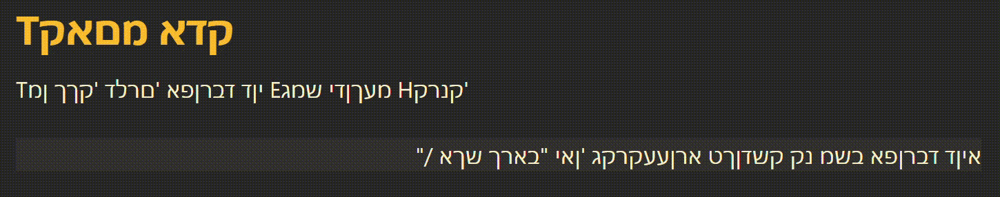

# Hebrew-English-language-switcher
While this repo starts with only this script, there will hopefully be others!

## Hebrew English language switcher
This script is to solve one specific problem with multi-Language keyboards: Starting to type something in one language and realising your keyboard is set to the wrong language.
Simply Select the text that is written in the wrong language, and the the hotkey Ctrl+Alt+Q to activate the script, it will replace any hebrew with the coresponding english, and english with the coresponding hebrew. 

### Usage
can be simply run with [Autohotkey](https://www.autohotkey.com/v2/), compiled with [AHK2EXE](https://github.com/AutoHotkey/Ahk2Exe) or run directly from the compiled version in the releases section (it too, is compiled with ahk2exe).

## V1.0.3: Bug fixes
This version fixes numbers and capital letters, along with the bug fixes commited in v1.0.2.

### V1.0.1: Added new feature!
This version adds a tray icon menu, with the options to auto change language (simply uses Shift+Alt) when the script is triggered and the option to auto enable autostarting (copies shortcut to %AppData%/\Microsoft\Windows\Start Menu\Programs\Startup\), sadly this feature is sort of buggy, and ~~will be fixed later on. currently simply press 'continue' when an error message pops up, the script will work fine from there.~~ Fixed in 1.0.2!

